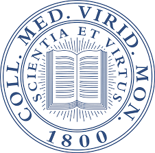
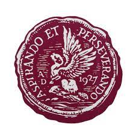

 

# **Middlebury College**
## Biochemistry Major — History of Art and Architecture Minor 
### *Enrolled September 2019 — Graduating February 2024* 
#### I took a gap semester during the Spring 2021 semester due to the COVID-19 pandemic's disruption of in-person learning for my science classes, during this time I worked at [Hartford Hospital](Experiences.html)
 * GPA: 3.92/4.00
 * Men’s Crew Team
 * Presidential Cabinet of Student Government: Director of Environmental Sustainability  
 * Communications Director of Stuck in the Middle A Capella  
 * Head Orientation Leader  
 * Omega Alpha (Community Service Social House)  
 * College Scholar (Highest Academic Honor Roll)
 

 

# **University of Oxford**
## Keble College 
### *Study Abroad during Trinity Term 2022* 
#### I enrolled in Middlebury College's Museum Studies program at Keble to take classes during Trinity Term to fulfill credits for my Art History minor
 * GPA: 4.00/4.00
 * Seminars: Perspectives on Heritage, How British Museums Work 
 
 

# **Avon Old Farms School**
## High School Diploma
### *Enrolled September 2019 — Graduating February 2024* 
 * The Cum Laude Society - 10th in Class
 * Monitor (Prefect)
 * The Order of Old Farms
 * Tri-Varsity Athlete
 * Admissions Ambassador/Head Tour Guide 
 * Yearbook Editor
 * Earned 8 Academic Book Prizes
 * AP Scholar with Distinction 
 * 2019 UNICO National Merit Scholarship