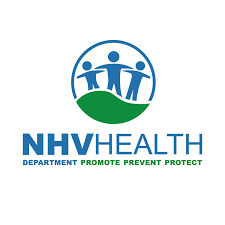

 

## **Chestnut Partners**
### *Incoming Investment Banking Summer Analyst*
#### Start Date: June 2023 
Chestnut Partners is a boutique investment bank that provides financial advice to clients in the life sciences industry.  

 

## **Hartford Hospital**
### *Clinical Anesthesiology Research Fellow*
#### November 2020 until Present 
 * Currently assigned to 6 clinical research studies covering Cardiac Anesthesia, Health Equity, and Conflicts of Interest
 * Wrote and submitted abstracts that were accepted to four poster presentation conferences: [PGA75](chrome-extension://efaidnbmnnnibpcajpcglclefindmkaj/https://iaapartners.com/wp-content/uploads/2021/11/PGA-Poster-BEQUEST-FINAL.pdf), [2022 IARS Annual Meeting](chrome-extension://efaidnbmnnnibpcajpcglclefindmkaj/https://iaapartners.com/wp-content/uploads/2022/04/ERAS_Emergency-CABG_IARS-3-14-22-v6.pdf), [2022 SCA Annual Meeting](chrome-extension://efaidnbmnnnibpcajpcglclefindmkaj/https://iaapartners.com/wp-content/uploads/2022/05/ERAS_Elective_CABG_SCA_MAY15-22.pdf), [PGA76](chrome-extension://efaidnbmnnnibpcajpcglclefindmkaj/https://iaapartners.com/wp-content/uploads/2023/01/Medical-Students-Assessment-of-Conflicts-of-Interest-in-Biomedical-Research.pdf)
* Conducted Literature Review & wrote the research protocols for studies sent to the Institutional Review Board (IRB)
 * Utilized REDCap to create a database for clinical research studies related to ophthalmology and cardiac anesthesia 
 * Worked on a variety of creative projects for IAA using Adobe Premiere Pro
 * Submitted Research Protocols to the IRB via IRIS and created Regulatory Binders for IRB-Approved Studies
 * Garnered 50+ hours of shadowing in the operating room: including orthopedic, ophthalmic, urology, cardiology, and neurosurgery procedures 
 
### *Patient Care Assistant*
#### June 2022 until Present 
 * Visited and conversed with hospital patients who suffer from dementia and delirium
 * Provided cognitive stimulation for patients suffering from cognitive impairments through effective bedside manner and appropriate doctor-patient rapport skills 
 
 

## **New Haven Health Department**
### *Epidemiology Research Intern*
#### July 2020 until September 2020
 * Learned and applied various software suites (ArcGIS Hub, R Coding, ESRI, Mapbox, Datawrapper, Excel) and statistical analysis methods to multiple projects for the deaprtment
 * Created a Healthy Equity presentation about the disproportionate impact of COVID-19 
 * Designed an ArcGIS website containing pertinent statistics and heat maps to document the department’s work in the COVID-19 effort 
 * Updated and created a presentation about HIV trends in the City of New Haven and the State of CT 
 * Certified Contact Tracer from the Johns Hopkins Bloomberg School of Public Health via Coursera
