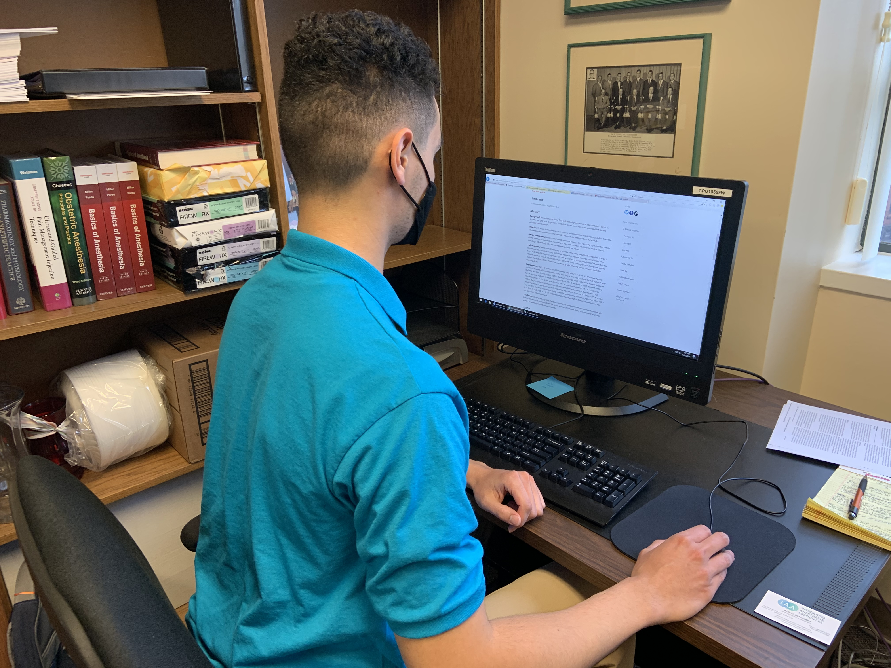
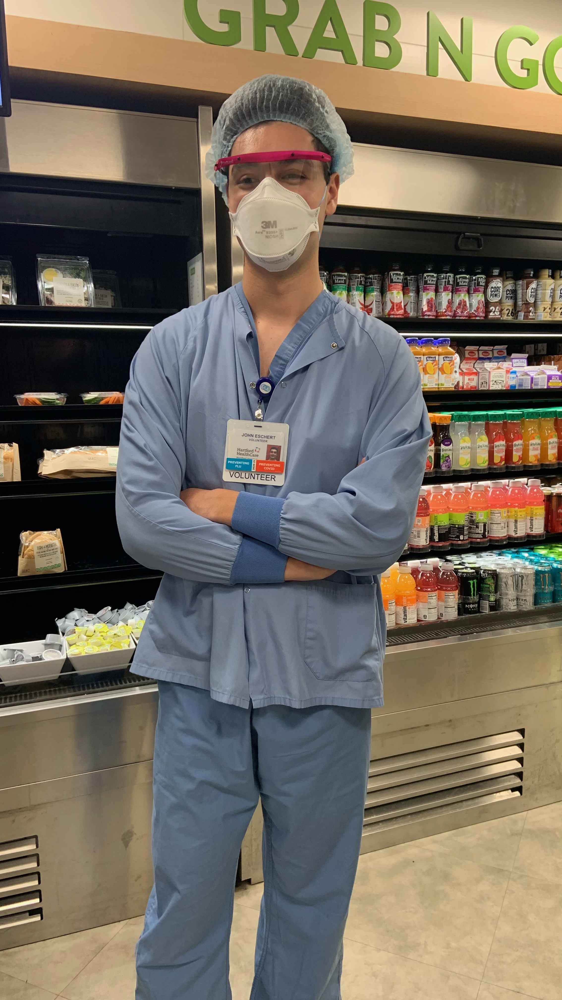

{width=45%}

A typical day of work in the [Hartford Hospital](Experiences.html) Anesthesia research office (Summer 2021)

  
Read More

I was the first official intern for the Anesthesia department. My work with their team during my Spring 2021 gap semester from Middlebury College was inherently versatile: my first project was creating a virtual tour video of the hospital's Bone & Joint Institute via Adobe Premiere Pro. The success I exhibited convinced my boss that an intern program would be worthwhile. So, I helped him design the first internship program modeled after my experience with his team. 

{width=25%}

I've observed nearly every clinical procedure performed at Hartford Hospital: from open heart surgery to a craniectomy to robot-assisted orthopedic surgery. 

