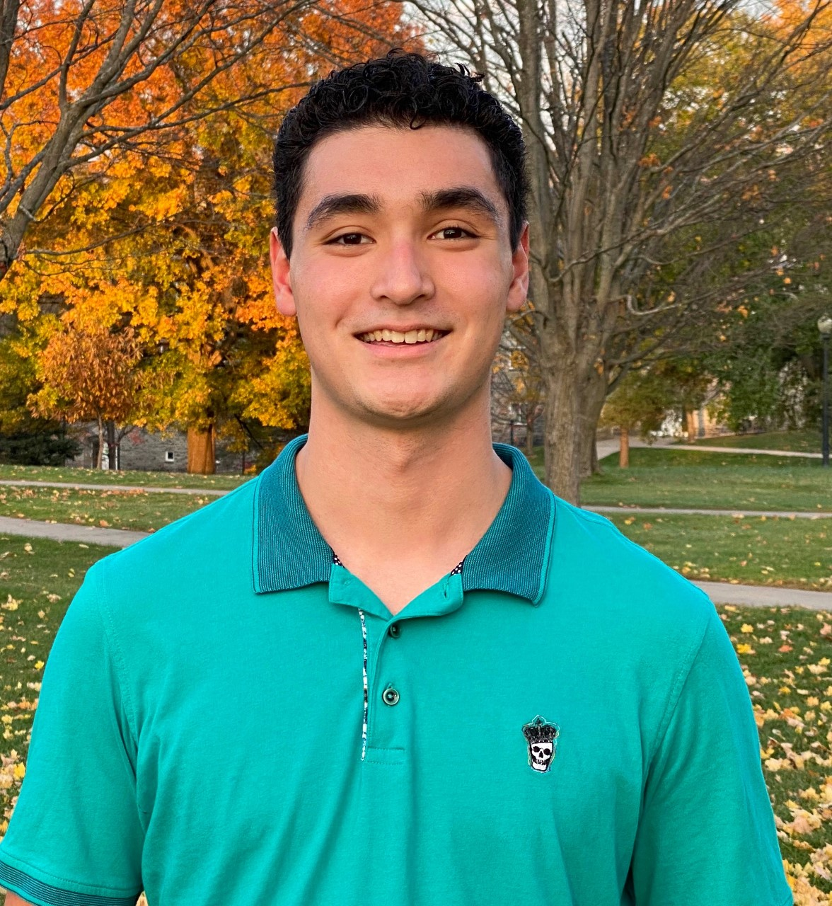

  
{width=50%}

# **About**
John Eschert is a published clinical researcher and an undergraduate student at Middlebury College interested in the intersection between healthcare and finance. John’s research experience began when he worked for the Chief Epidemiologist at the New Haven Health Department during Connecticut’s summer 2020 COVID-19 surge. Here, John’s projects focused on health equity and racial disparities in healthcare access. This work informed John’s first clinical research publication in a high-impact medical journal: an accomplishment he earned while interning as a Clinical Anesthesiology Research Fellow at Hartford Hospital. In this role, he garnered 2 manuscript publications and 4 poster presentation acceptances at national medical conferences: John recently presented at the PostGraduate Assembly in Anesthesiologists in December 2022. In addition, John works as a Patient Care Assistant in Hartford Hospital’s Geriatrics Department during college breaks. John is currently an Incoming Investment Banking Summer Analyst at Chestnut Partners, a boutique investment bank in Boston that provides financial advice to healthcare and life science clients.

# [Work Experiences](Experiences.html) 
# [Education](Education.html)
# [Publications](Publications.html) 
# [Snapshots of my Work](Snapshots.html)

# **Samples of my Work**

```{r echo=FALSE}
vembedr::embed_url("https://youtu.be/IMFeL1YvsXg")
```


# **Getting to Know Me in 5 Fun Facts**

{width=45%}

* I grew up in Avon, CT and have lived there my whole life
* I am Polynesian 
* Two hobbies of mine are Painting and anything Music-Related!
* I have two black labs at home named Deano and Nauset
* My favorite forms of exercise are Running and Skiing 

